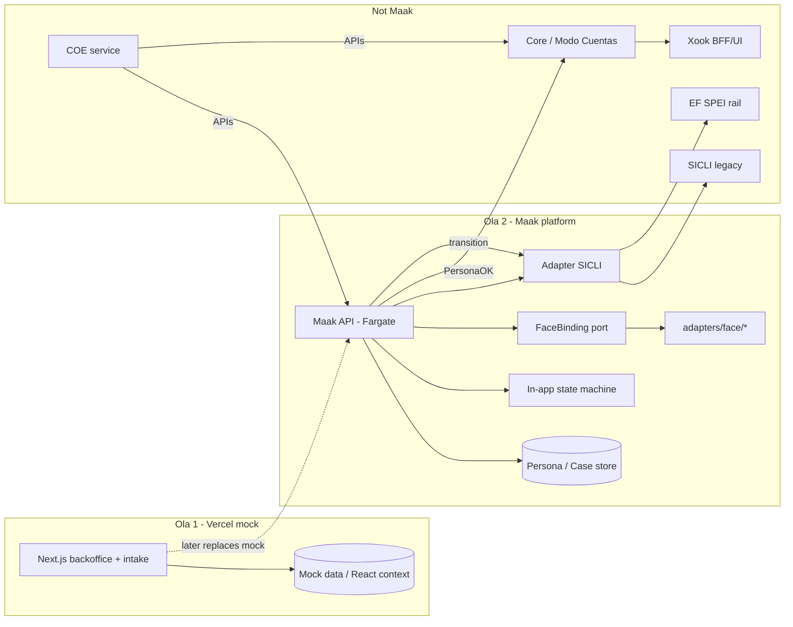

# Architecture — waves & boundaries

## Waves

| Wave | What ships | Runtime |
|---|---|---|
| **Ola 1 (now)** | Clickable mock UI: cases, onboarding, people, rules, intake, ingestion agent UI | Next.js on **Vercel**; mock data; password gate |
| **Ola 2** | Real API + persistence + FaceBinding adapters + SICLI transition adapter | Maak API on **AWS Fargate**; queues (SQS) later; rails thin for lists/face |

Ola 1 must not pretend ola 2 exists: no fake SPEI, no vendor face SDKs in the app tree, no Account/CLABE screens.

## Boundaries

## Rules of the road

- Maak emits **PersonaOK**; it does not open CLABEs or move SPEI.
- Rules engine: light in-app SM (+ SQS later) — see `ADR-001_Rules_Engine_Light.md`.
- Face: provider-agnostic port — see `FACE_BINDING.md`.
- Deploy path for API: Fargate for Maak test — see `ADR-003_Fargate_vs_EKS.md`.
